#   Integrantes
-   JAVIER OSWALDO MIRÓN CIFUENTES      201602694
-   WILFRED STEWART PÉREZ SOLORZANO     201408419
-   HECTOR JOSUE OROZCO SALAZAR         201314296

#   Manual de configuracion de areas de trabajo para una red privada
##  VLAN
---
Las VLAN se utilizaran para crear las diferentes areas de trabajo para cada uno de los departamentos dentro de la red privada las cuales estaran divididas de la siguiente manera:

| VLAN  | Departamento|  Red | 
|---|---|---|
| 10  | Informatica | 192.168.18.0/24 |  
| 20 | Ventas | 192.168.28.0/24|
| 30 | Contabilidad | 192.168.38.0/24|  


# Distribucion de topologias
---
## Topología General


<br>

## Topología 1
Esta topología estará dividida en 3 partes, cada una de estas se inteconectara con las demás con ayuda de un dispositivo Cloud, creando una rede de área local, además esta topología tendrá un dispositivo Cloud que estará comunicado con la topología 2 que será explicada despues.

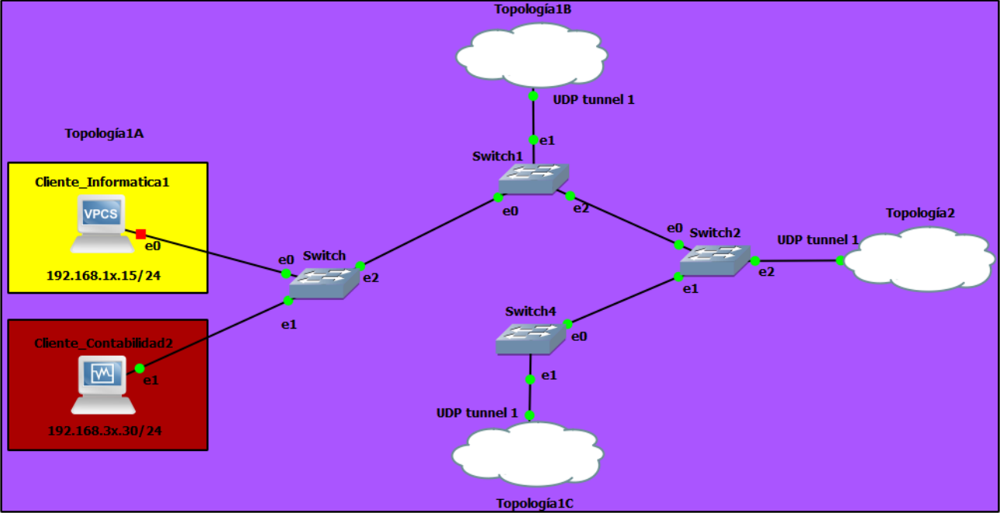

## Topología 1A
Como se muestra en la imagen, se configurara dde la siguiente manera:
* Cliente_Ventas1 será una VPC estándar de GNS3
* Cliente_Informática2 será una máquina virtual (VirtualBox o VMWare) con S.O Linux

### Configuracion
---
Importar una maquina vpc y una maquina Virtual para el departamento de Informatica
* Configuracion VPC Cliente_Ventas1
    - Iniciar la maquina VPC y acceder a la consola
    - Configurar la ip de esta maquina con el siguiente comando 
```txt
    ip 192.168.28.15 255.255.255.0 192.168.28.254
```
 Guardar la configuracion
```txt
    save
```
* Configuración del Cliente_Informatica2
  * Iniciar y abrir la maquina en VirtualBox
  * Una vez iniciada la maquina virtual, accederemos a configuracion
  * Dirigirse a la opcion de Red y seleccionar el icono de configuracion
  * Seleccionar la pestaña IVP4 y seleccionar la opcion Manual
  * Ingresar la siguiente conferencia y reiniciar el equipo.
```txt
     ip                     Mascara de red           Gateway 
     192.168.18.30          255.255.255.0            192.168.18.254
```

* Configuracion del Switch 
  * Iniciar y abrir la consola del switch 
  * Utilizando la interfaz del switch se configuran los puertos de la siguiente manera
```txt
    Puerto 0: 
        Modo: acces
        Vlan: 20
        
    Puerto 1: 
        Modo: acces
        Vlan: 30
        
   
    Puerto 2: 
        Modo: trunk
        Vlan: 1
```


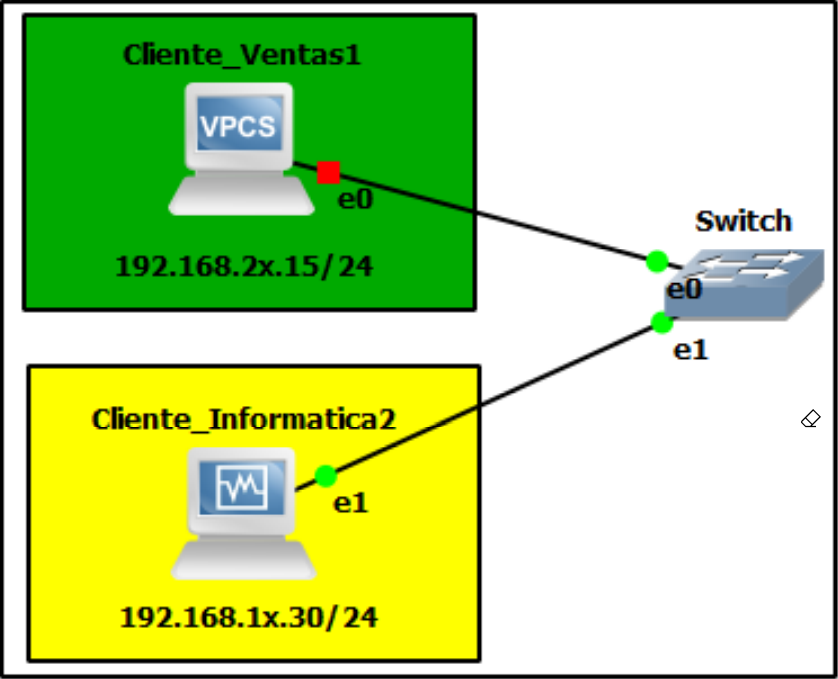

## Topología 1B
De estos 2 clientes que se muestran, serán configurados de esta manera:
* Cliente_Contabilidad1 será una VPC estándar de GNS3
* Cliente_Ventas2 será una máquina virtual (VirtualBox o VMWare) con S.O Linux

### Configuracion
---
Importar una maquina vpc y una maquina Virtual para el departamento de Informatica

* Configuracion VPC Cliente_Contabilidad1
    - Iniciar la maquina VPC y acceder a la consola
    - Configurar la ip de esta maquina con el siguiente comando 
```txt
    ip 192.168.38.15 255.255.255.0 192.168.38.254
```
   * - Guardar la configuracion
```txt
    save
```
* Configuración del Cliente_Ventas2
  * Iniciar y abrir la maquina en VirtualBox
  * Una vez iniciada la maquina virtual, accederemos a configuracion
  * Dirigirse a la opcion de Red y seleccionar el icono de configuracion
  * Seleccionar la pestaña IVP4 y seleccionar la opcion Manual
  * Ingresar la siguiente conferencia y reiniciar el equipo.
```txt
     ip                     Mascara de red           Gateway 
     192.168.28.30          255.255.255.0            192.168.28.254
```

* Configuracion de la nube de Topologia1
  * Acceder a configuracion y a la pestaña Tunel UDP
  * Ingresar la siguiente configuracion y la añadiremos 
```txt
     Name:              UDP tunel Topologia1
     Local port:        30000
     Remote host:       10.8.0.2
     Remote port:       20000 
```

* Configuracion del Switch 
  * Iniciar y abrir la consola del switch 
  * Utilizando la interfaz del switch se configuran los puertos de la siguiente manera
```txt
    Puerto 0: 
        Modo: acces
        Vlan: 30
        
    Puerto 1: 
        Modo: acces
        Vlan: 20
        
   
    Puerto 2: 
        Modo: trunk
        Vlan: 1
```


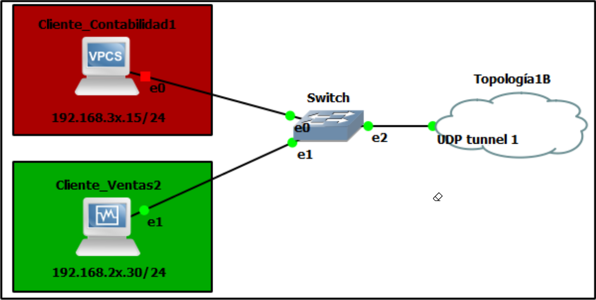


## Topología 1C
De estos 2 clientes que se muestran, serán configurados de esta manera:
* Cliente_Informática1 será una VPC estándar de GNS3
* Cliente_Contabilidad2 será una máquina virtual (VirtualBox o VMWare) con S.O
Linux

### Configuracion
---
Importar una maquina vpc y una maquina Virtual para el departamento de Informatica

* Configuracion VPC Cliente_Informatica1
    - Iniciar la maquina VPC y acceder a la consola
    - Configurar la ip de esta maquina con el siguiente comando 
```txt
    ip 192.168.38.15 255.255.255.0 192.168.38.254
```
   * - Guardar la configuracion
```txt
    save
```
* Configuración del Cliente_Contabilidad2
  * Iniciar y abrir la maquina en VirtualBox
  * Una vez iniciada la maquina virtual, accederemos a configuracion
  * Dirigirse a la opcion de Red y seleccionar el icono de configuracion
  * Seleccionar la pestaña IVP4 y seleccionar la opcion Manual
  * Ingresar la siguiente conferencia y reiniciar el equipo.
```txt
     ip                     Mascara de red           Gateway 
     192.168.18.15          255.255.255.0            192.168.18.254
```

* Configuracion de la nube de Topologia1C
  * Acceder a configuracion y a la pestaña Tunel UDP
  * Ingresar la siguiente configuracion y la añadiremos 
```txt
     Name:              UDP tunel Topologia1
     Local port:        30000
     Remote host:       10.8.0.3
     Remote port:       20000 
```

* Configuracion del Switch 
  * Iniciar y abrir la consola del switch 
  * Utilizando la interfaz del switch se configuran los puertos de la siguiente manera
```txt
    Puerto 0: 
        Modo: acces
        Vlan: 10
        
    Puerto 1: 
        Modo: acces
        Vlan: 30
        
   
    Puerto 2: 
        Modo: trunk
        Vlan: 1
```

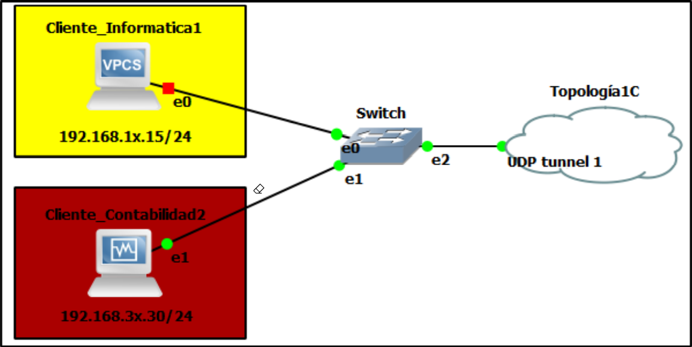


## Topología 2

 Esta topología tendrá la función de contener a todos los servidores web, sus páginas web
podrán ser accedidos por los Clientes Virtualizados. Por ejemplo el Cliente_Informática2
podrá acceder al servidor web únicamente de Informática. Esto significa que tanto
Cliente_Informática2 como Cliente_Informática podrán realizar un ping al servidor web de
Informática y viceversa.

### Configuracion
* Configuración del ServidorWeb_Informatica
  * Iniciar y abrir la maquina en VirtualBox
  * Una vez iniciada la maquina virtual, accederemos a configuracion
  * Dirigirse a la opcion de Red y seleccionar el icono de configuracion
  * Seleccionar la pestaña IVP4 y seleccionar la opcion Manual
  * Ingresar la siguiente conferencia y reiniciar el equipo.
```txt
     ip                     Mascara de red           Gateway 
     192.168.18.130          255.255.255.0            192.168.18.254
```

* Configuración del ServidorWeb_Ventas
  * Iniciar y abrir la maquina en VirtualBox
  * Una vez iniciada la maquina virtual, accederemos a configuracion
  * Dirigirse a la opcion de Red y seleccionar el icono de configuracion
  * Seleccionar la pestaña IVP4 y seleccionar la opcion Manual
  * Ingresar la siguiente conferencia y reiniciar el equipo.
```txt
     ip                     Mascara de red           Gateway 
     192.168.28.15          255.255.255.0            192.168.28.254
```

* Configuración del Servidor_Contabilidad
  * Iniciar y abrir la maquina en VirtualBox
  * Una vez iniciada la maquina virtual, accederemos a configuracion
  * Dirigirse a la opcion de Red y seleccionar el icono de configuracion
  * Seleccionar la pestaña IVP4 y seleccionar la opcion Manual
  * Ingresar la siguiente conferencia y reiniciar el equipo.
```txt
     ip                     Mascara de red           Gateway 
     192.168.38.15          255.255.255.0            192.168.38.254
```

* Configuracion del Switch 
  * Iniciar y abrir la consola del switch 
  * Utilizando la interfaz del switch se configuran los puertos de la siguiente manera
```txt
    Puerto 0: 
        Modo: acces
        Vlan: 10
        
    Puerto 1: 
        Modo: acces
        Vlan: 20
        
   Puerto 2: 
        Modo: acces
        Vlan: 30
        
    Puerto 3: 
        Modo: trunk
        Vlan: 1
```

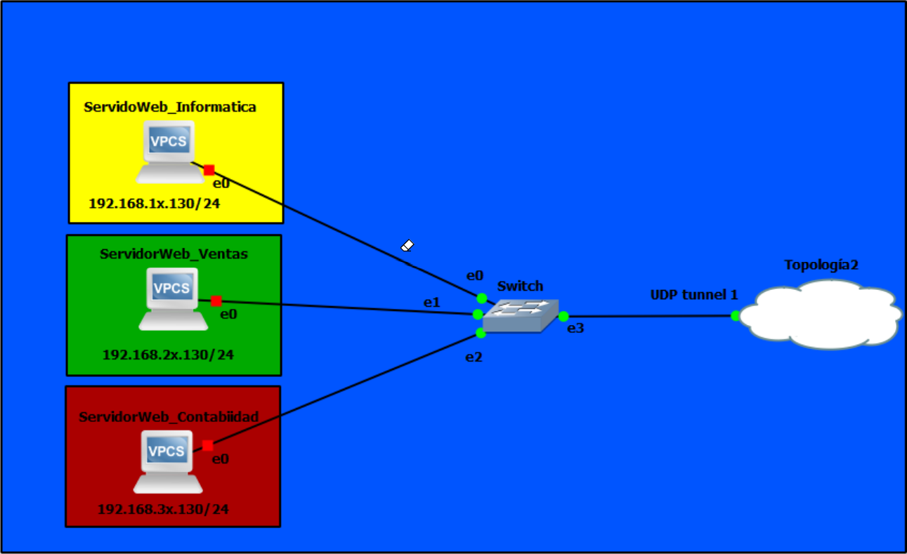

# Configuracion del entorno de trabajo

## Configuracion de Maquinas virtuales 
Se realizara la configuracion de maquinas virtuales con el sistema operativo Linux, realizando virtualizacion de este sistema utilizando el programa de Virtual Box el cual podremos descargar desde su pagina principal e instalando este sistema operativo.

Una vez creada cada una de las maquinas para cada departamento se realizara la importacion de estas a GNS3

### Pasos:
* Iniciamos el programa de GNS3
* Seleccionamos la ruta donde se almanara la topologia
* Nos dirigiremos a la pestaña de Edit y seleccionaremos la opocion de preferences.. ( Ctrl + Shift + P)
*  En la nueva ventana nos dirigiremos a la pestaña de VirtualBox VMs 
*  Haremos click en la opcion de New para importar una maquina virtual
*  En el nuevo recuadro dejaremos la opcion preseleccionada y daremos en Next 
*  Seleccionaremos la maquina virtual a importar y marcaremos la opcion Use as linked base VM (experimental) y haremos click en siguiente
*  Se mostrara la maquina virtual importada y procederemos a editarla, para ello seleccionaremos la opcion de Edit
*  Marcaremos la opcion de Allow GNS3 to use any configured VirtualBox adapter y daremos click en ok
*  Para completar el proceso de importacion haremos click en Apply y en Ok y ya podremos visualizar nuestra maquina virtual.

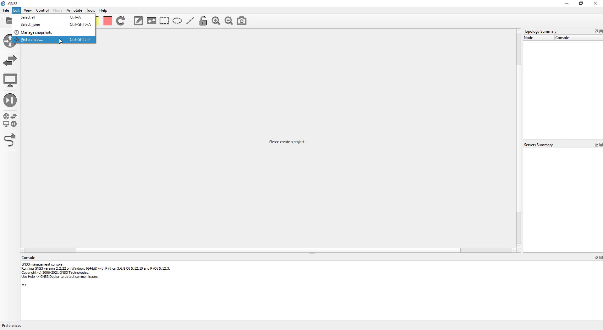
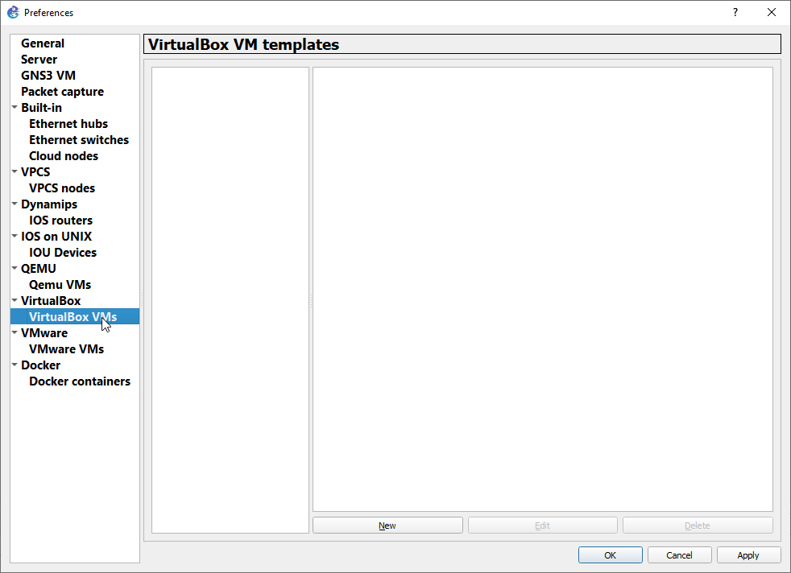
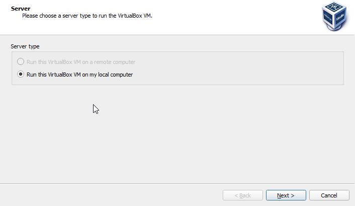
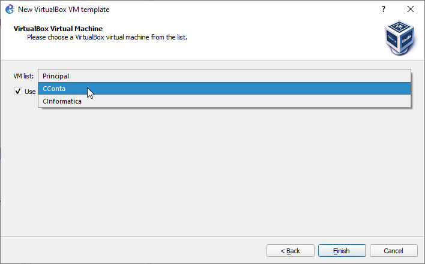
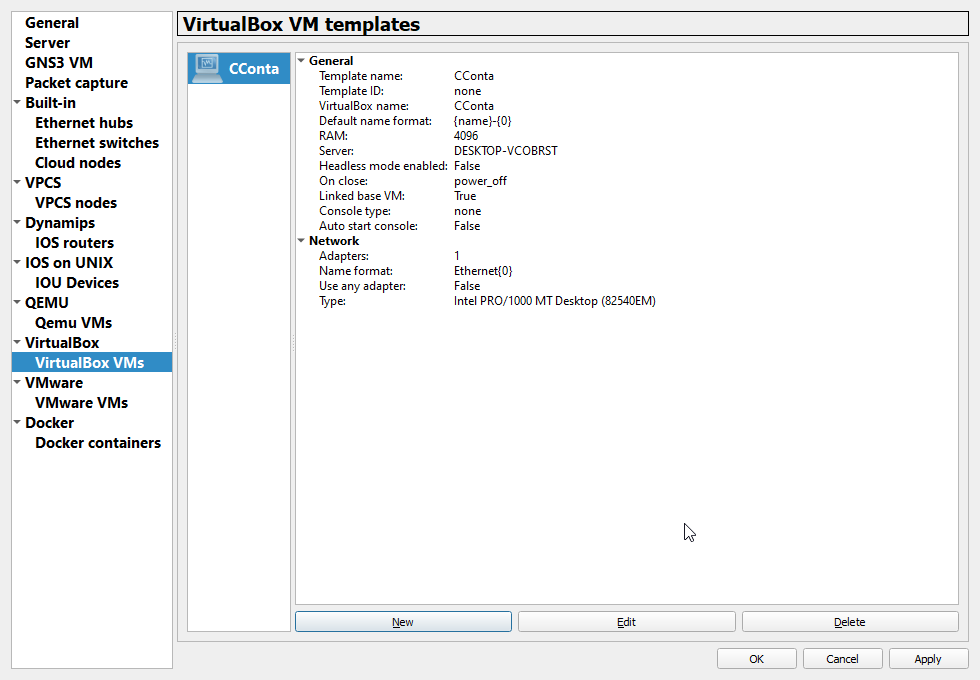
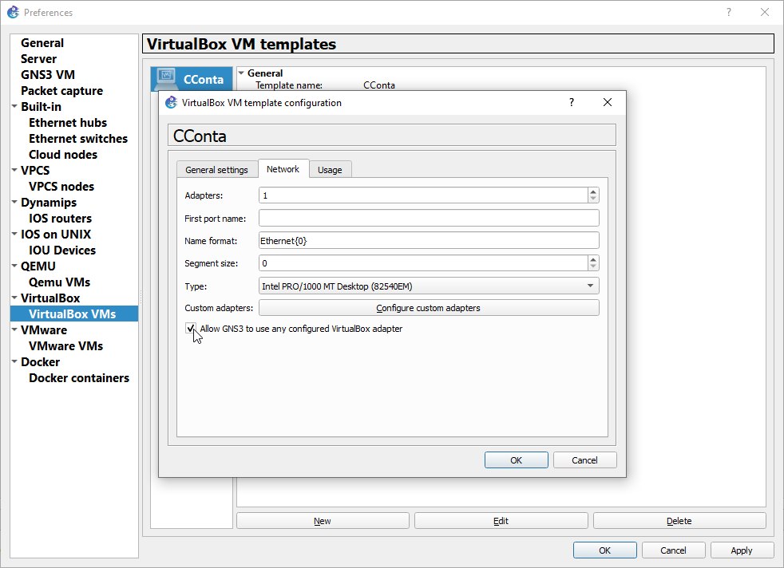


# Servidores
## Configuracion Inicial
---
Para cada uno de los servidores se realizara la siguiente configuracion dentro de la virtualizacion de cada maquina virtual.

Para esto utilizaremos Apache2 para la distribucion de informacion a travez de una pagina web
<br>

## Instalacion de Apache2
---
Actualizacion de paquetes
```txt
     sudo apt update
```
Instalacion de apache
```txt
     sudo ufw app list
```
* Salida 
```txt
     Output
            Available applications:
            Apache
            Apache Full
            Apache Secure
            OpenSSH
```
Se recomienda habilitar el perfil más restrictivo, que de todos modos permitirá el tráfico que configuró. Debido a que en esta guía aún no configuramos SSL para nuestro servidor, solo deberemos permitir el tráfico en el puerto 80:
```txt
     sudo ufw allow 'Apache'
```
Comprobación del servidor web
```txt
     sudo systemct1 status apache2
```
*   Salida
```txt
    apache2.service - The Apache HTTP Server
        Loaded: loaded (/lib/systemd/system/apache2.service; enabled; vendor preset: enabled)
        Active: active (running) since Thu 2020-04-23 22:36:30 UTC; 20h ago
        Docs: https://httpd.apache.org/docs/2.4/
        Main PID: 29435 (apache2)
        Tasks: 55 (limit: 1137)
        Memory: 8.0M
        CGroup: /system.slice/apache2.service
             ├─29435 /usr/sbin/apache2 -k start
             ├─29437 /usr/sbin/apache2 -k start
             └─29438 /usr/sbin/apache2 -k start
```

Intente escribir esto en la línea de comandos de su servidor:
```txt
     hostname -I
```
Cuando tenga la dirección IP de su servidor, introdúzcala en la barra de direcciones de su navegador
```txt
     http://your_server_ip
```

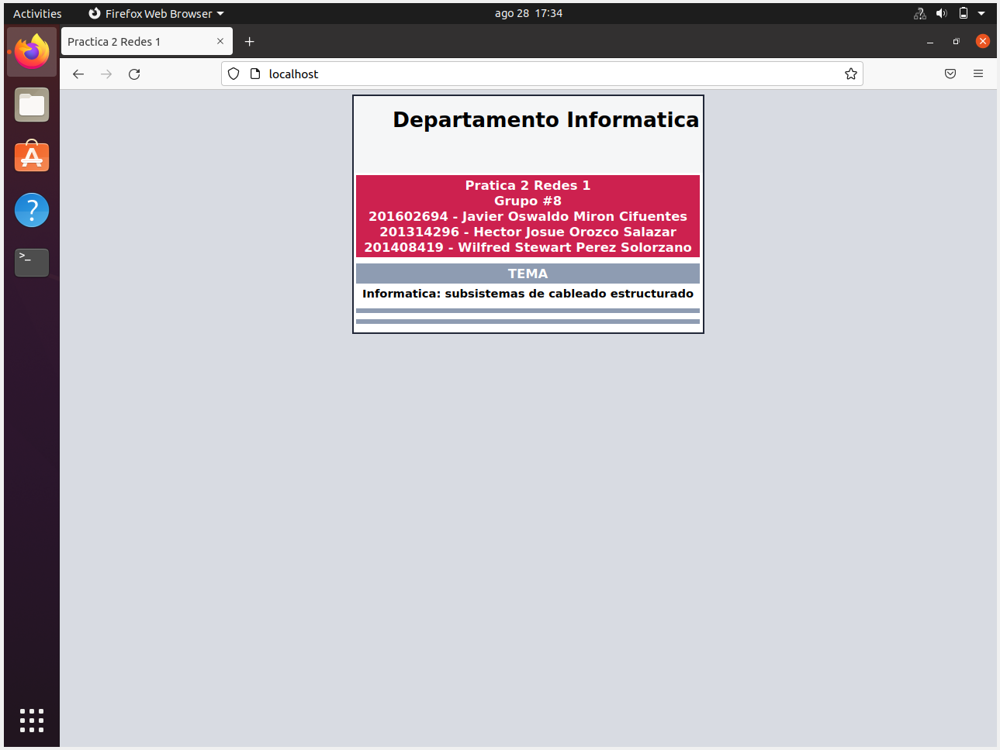
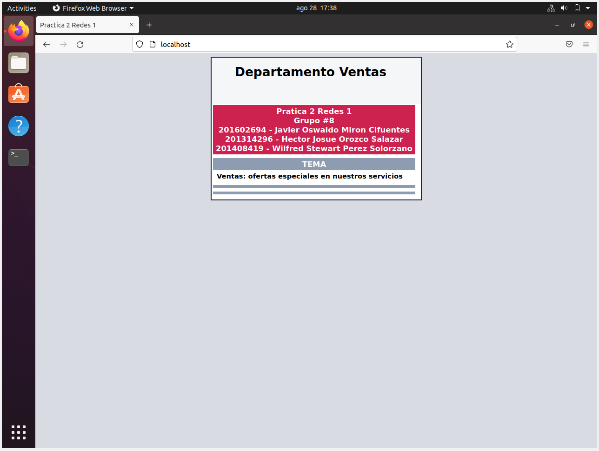
